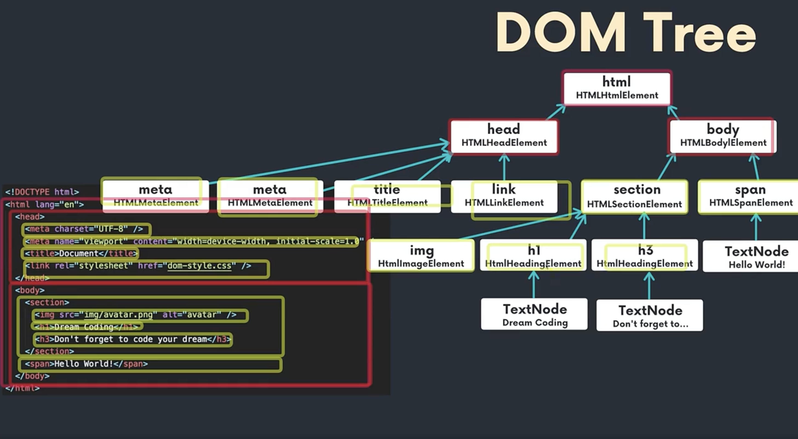

# 4.1 DOM 큰 그림 이해하기

**DOM(Document Object Model)**

- HTML 파일을 웹이지가 읽음
- 브라우저에서는 body, section, h1 등 각각의 태그들을 분석해서 **Node**로 변환함
- 즉, HTML의 태그가 JavaScript 노드로 변환하는 것임
  - 브라우저가 이해할 수 있는 자신들만의 오브젝트로 변환하게 되는 것이다.
  - 이 노드 안에는 우리가 tag 안에 작성했었던 class, text 같은 모든 정보들이 포함된다.

Node는 EventTarget 오브젝트를 상속한다.

- 모든 Node는 이벤트가 발생할 수 있다.
- Document/Element/Text도 Node를 상속하기 때문에 Document도 이벤트가 발생할 수 있다.
- 즉, 모든 Tag 요소들은 각각 HTMLElement이고 이는 곧 Element이고 이는 곧 Node이고 Node는 곧 EventTarget이다 (상속관계)
- 브라우저가 HTML 파일을 한 줄 한 줄씩 읽으면서 DOM 트리로 변환한다.
- DOM 트리로 변환하면서 브라우저가 이해할 수 있도록 자신들만의 오브젝트 나무로 만들어나가는 것이다.

- HTML 태그에는 그에 상응하는 돔트리 요소가 있다.
- HTML 파일을 브라우저에서 읽으면 브라우저도 실행되고 있는 어플리케이션이기 때문에 이 어플리케이션이 이해할 수 있는, 메모리에 보관할 수 있는 오브젝트로 변환하게 된다.
- 브라우저에서는 각각의 태그들이 그에 맞는 오브젝트로 매핑되어서 표기되어진다.

**브라우저가 실행될 때 웹페이지를 읽으면?**

- Global Object에는 window가 들어있음
- window에는 document가 들어있음
- 이 document 오브젝트 안에는 페이지별로 정의한 요소들이 나무처럼 구성되어져있음
