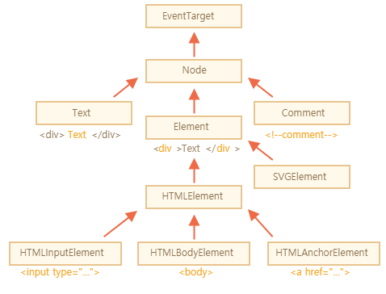

#2.2 Browser 구조 분석

**Window**

- 브라우저에서 웹 페이지를 열게되면 Window라는 전체적인 객체가 존재한다.
- Window는 우리의 페이지뿐 아니라, 브라우저에서 현재 열려있는 전체적인 창을 의미함

**Document**

- 페이지가 표기되는 부분이 Document 객체이다.
  - 즉, Document는 우리가 HTML에서 작성한 요소들이 표시되어지는 부분
- Window 객체의 자식으로 존재한다.

**Navigator**

- 사용자 눈에 보이진 않지만, 전체적으로 브라우저에 관련된 정보들이 담겨있는 유용한 객체

**페이지를 브라우저에서 열게되면?**

- Window라는 전역 오브젝트 존재
  - DOM (document object model)
    - document
    - DOM을 이용해서 새로운 요소들이 추가, 빼거나 움직이는 것들이 가능하게 됨
  - BOM (browser object model)
    - 브라우저에 관련된 요소들
    - navigator, location. fetch. storage 등 Web API와 관련된 오브젝트들이 들어있음
  - JavaScript
    - 우리가 작성한 JS 코드들
    - 그래서 우리가 자바스크립트로 브라우저 위에서 동작하는 것을 만들 때는 이런 DOM에 관련된 api도 쓸 수 있고, BOM에 관련된 api도 쓸 수 있고, window 오브젝트에 관련된 api도 쓸 수 있음
- 브라우저 console.log(this) 입력하면?
  - Window 객체가 나옴
  - 기본적으로 Window는 글로벌 오브젝트이기 때문에 console.log(innerWidth)라고만 쳐도 윈도우 창의 너비가 나옴 (console.log(window.width)라고 하는 것과 동일함)
  - alert(’hello’) 도 가능, 윈도우 오브젝트 안에 들어있었던 api를 이용해서 사용자에게 알럿창도 줄 수 있는 것
  - 윈도우는 기본적으로 글로벌 객체여서 window. 을 찍지 않아도 되는 것임
- window.navigator 를 입력하면?
  - window 객체 안에 있는 navigator 객체들이 나오는데 브라우저에 포함되어있는 유용한 정보들이 있음
- window 에서 뭘 자주 쓰나요?
  - size : 윈도우 자체 사이즈
  - scroll : 스크롤 관련
  - load : 작성한 웹페이지가 브라우저에 로드되었는지 안되어있는지 확인할 때 쓰임
