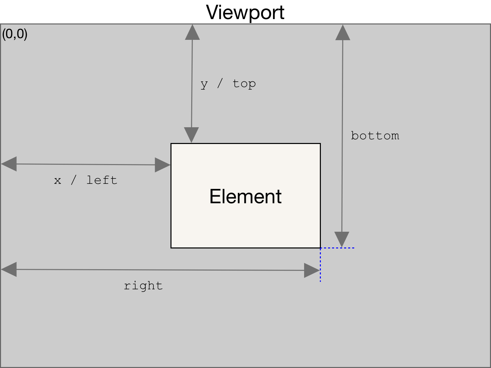

# 2.4 coordinates

- Element.getBoundingClientRect() : Element ⇒ Document 객체에 들어있는 모든 요소들, 이미지 태그나 텍스트 등 다양한 태그들이 element임, 요소는 전부 다 getBoundingClientRect() 함수 사용가능
  

  - 요소의 사이즈나 위치에 관련된 다양한 정보를 알 수 있음
  - left ⇒ 왼쪽에서 요소까지의 거리 (X 좌표와 같음)
  - top ⇒ 위에서부터 얼마나 떨어져있는지 (Y 좌표와 같음)
  - bottom ⇒ 요소의 제일 밑부분이 브라우저에서 제일 위에서 얼마나 떨어져있는지
  - right ⇒ 왼쪽에서 제일 오른쪽 끝에까지 얼마나 떨어져있는지

  ⇒ 여기서 헷갈릴 수 있는 것이 CSS에서 right과 bottom이랑 다른 방식으로 쓰고 있기 때문

  - CSS에서 포지션을 absolute나 relative를 주게 되면, position을 top, left, right, bottom을 이용해서 지정할 수 있음
    - right은 browser에서 제일 오른쪽에서 떨어져있는 거리
    - bottom은 browser 제일 밑에서부터 떨어져있는 거리

- Client x,y vs Page x,y
  - 사용자가 어느정도 스크롤링한 상태에서 사용자가 클릭하게되면, Client의 x,y와 Page의 x,y가 서로 다름
  - 클릭하게 되면 event 오브젝트가 우리가 등록한 listener에 전달이 됨
    - **client x, y**
      - event에는 client x, y값이 들어있음
      - client x, y는 사용자가 보는 페이지와 상관없이 브라우저 윈도우 창에서 x, y가 얼마나 떨어져있는지 할당
    - **page x, y**
      - page x, y는 페이지 자체에서 떨어진 값이 할당됨
      - 문서의 제일 시작점부터 계산이 되는 것
